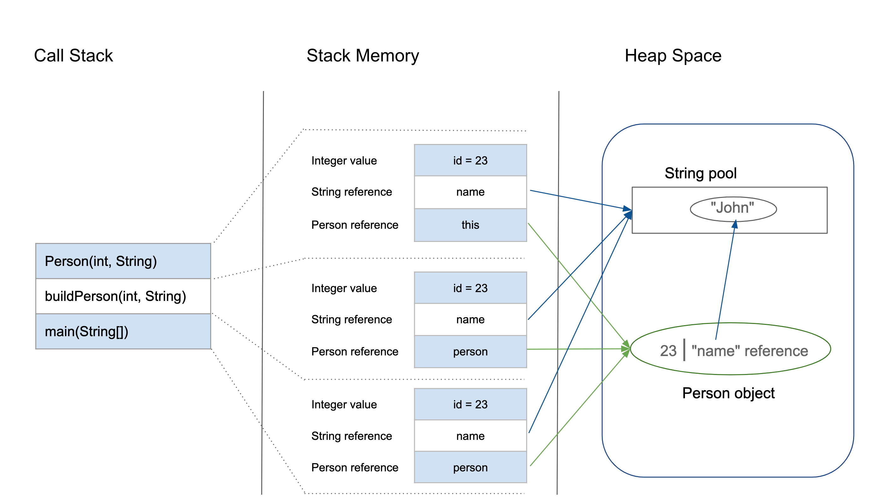

## Heap vs Stack Memory

When we create a new variable, java designates memory to either to stack or heap memory

**Stack Memory**

Stack Memory in Java is used for static memory allocation and the execution of a thread
Access to this memory is in Last-In-First-Out (LIFO) order. Whenever we call a new method, 
a new block is created on top of the stack which contains values specific to that method, like primitive variables and references to objects.

When the method finishes execution, its corresponding stack frame is flushed, the flow goes back to the calling method, and space becomes available for the next method.

Some other features of stack memory include:

- It grows and shrinks as new methods are called and returned, respectively.
- Variables inside the stack exist only as long as the method that created them is running.
- It's automatically allocated and deallocated when the method finishes execution.
- If this memory is full, Java throws java.lang.StackOverFlowError.
- Access to this memory is fast when compared to heap memory.
- This memory is threadsafe, as each thread operates in its own stack.


**Heap Memory**

Heap space is used for the dynamic memory allocation of Java objects and JRE classes at runtime.

We can break this memory model down into smaller parts, called generations, which are:

- Young Generation 
- Old Generation 
- Permanent Generation 
                      
Some other features of heap space include:

- String pool is in the heap memory
- It's accessed via complex memory management techniques that include the Young Generation, Old or Tenured Generation, and Permanent Generation.
- If heap space is full, Java throws java.lang.OutOfMemoryError.
- Access to this memory is comparatively slower than stack memory
- This memory, in contrast to stack, isn't automatically deallocated. It needs Garbage Collector to free up unused objects so as to keep the efficiency of the memory usage.
- Unlike stack, a heap isn't threadsafe and needs to be guarded by properly synchronizing the code.

## Step By Step

```java
class Person {
    int id;
    String name;

    public Person(int id, String name) {
        this.id = id;
        this.name = name;
    }
}

public class PersonBuilder {
    private static Person buildPerson(int id, String name) {
        return new Person(id, name);
    }

    public static void main(String[] args) {
        int id = 23;
        String name = "John";
        Person person = null;
        person = buildPerson(id, name);
    }
}
```

Let's analyze this step-by-step:

1. When we enter the main() method, a space in stack memory is created to store primitives and references of this method.

- Stack memory directly stores the primitive value of integer id.
- The reference variable person of type Person will also be created in stack memory, which will point to the actual object in the heap.
2. The call to the parameterized constructor Person(int, String) from main() will allocate further memory on top of the previous stack. This will store:
- The *this* object reference of the calling object in stack memory
- The primitive value id in the stack memory
- The reference variable of String argument name, which will point to the actual string from string pool in heap memory
3. The main method is further calling the buildPerson() static method, for which further allocation will take place in stack memory on top of the previous one. This will again store variables in the manner described above.
4. However, heap memory will store all instance variables for the newly created object person of type Person.

